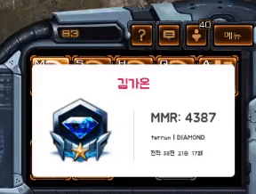
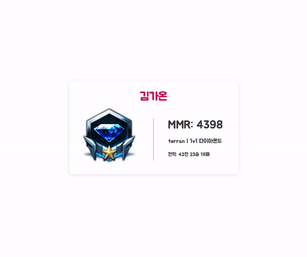

# 스타우터 -- 개인방송용 스타크래프트2 MMR 표시기

개인 방송 중 본인의 스타크래프트2 MMR을 표시할 수 있는 웹 서비스입니다.

- [실제 서비스 페이지](https://sc2outer.app:3000)
- [사용법](http://gall.dcinside.com/mgallery/board/view/?id=sc2&no=228095&exception_mode=recommend&s_type=search_all&s_keyword=방송할%20때&page=1)

## Usage

[블리자드 API](http://develop.battle.net)에 자신의 앱을 등록하고, Redirect URL 목록에 `https://localhost:3000/auth/bnet/callback`을 추가해 주세요. 블리자드가 제공하는 BNET ID와 BNET SECRET을 `secrets.js`에 입력하세요.  
또한, https 설정을 위해(Blizzard 로그인에 꼭 필요합니다) [이 링크](https://kr.minibrary.com/353/)를 참고하여 `privkey.pem`과 `cert.pem` 파일을 만들어 주시고, 그 경로를 또한 `secrets.js`에 입력해 주세요.

이후 `npm install`로 모듈을 설치하고 `npm start` 명령어로 서버를 실행시키면 됩니다.

## Example

